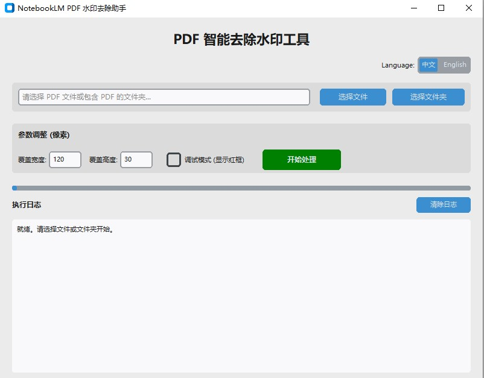

# NotebookLM PDF 水印去除助手 (NotebookLM Watermark Remover)

这是一个简单、高效的本地工具，专为去除 Google NotebookLM 生成的 PDF 文件中的页脚水印而设计。

它采用**背景色自适应覆盖**的方案，而非破坏性的图像擦除，因此`处理速度极快且不影响原文件布局。`

## 主要功能

*   **GUI 图形界面**：基于 CustomTkinter 构建，界面美观现代。
*   **智能吸色**：自动检测每一页水印周围的背景颜色（无论是纯白还是米黄色），实现完美融合覆盖。
*   **批量处理**：支持选择单个文件或整个文件夹。
    *   批量模式下，会在同级目录下创建 `去水印` 文件夹，保持原文件目录整洁。
*   **参数微调**：支持自定义覆盖区域的宽、高及边距。
*   **调试模式**：可开启红色边框预览覆盖区域，方便确认位置。

## 使用方法

### 方式一：直接运行可执行文件 (Windows)
1. 在 `dist` 文件夹中找到 `PDF水印去除助手.exe`。
2. 双击运行。
3. 点击“选择文件”或“选择文件夹”。
4. 点击“开始处理”。
5. 处理后的文件将保存在原路径下的 `去水印` 文件夹中。

### 方式二：源码运行
需要安装 Python 3.8+ 环境。

1. **安装依赖**：
   ```bash
   pip install customtkinter pymupdf
   ```

2. **运行脚本**：
   ```bash
   python gui_watermark_remover.py
   ```

## 开发构建

如果你想自己打包 exe 文件：

```bash
pip install pyinstaller
pyinstaller --noconsole --onefile --name "PDF水印去除助手" gui_watermark_remover.py
```

## 核心原理

NotebookLM 生成的 PDF 通常是由图片构成的（类似 PPT 导出）。本工具利用 PyMuPDF (fitz) 库：
1. 定位到页面右下角的水印区域。
2. 读取该区域附近的像素颜色作为背景色。
3. 绘制一个无边框的矩形覆盖在该区域上。

## 许可证

MIT License
